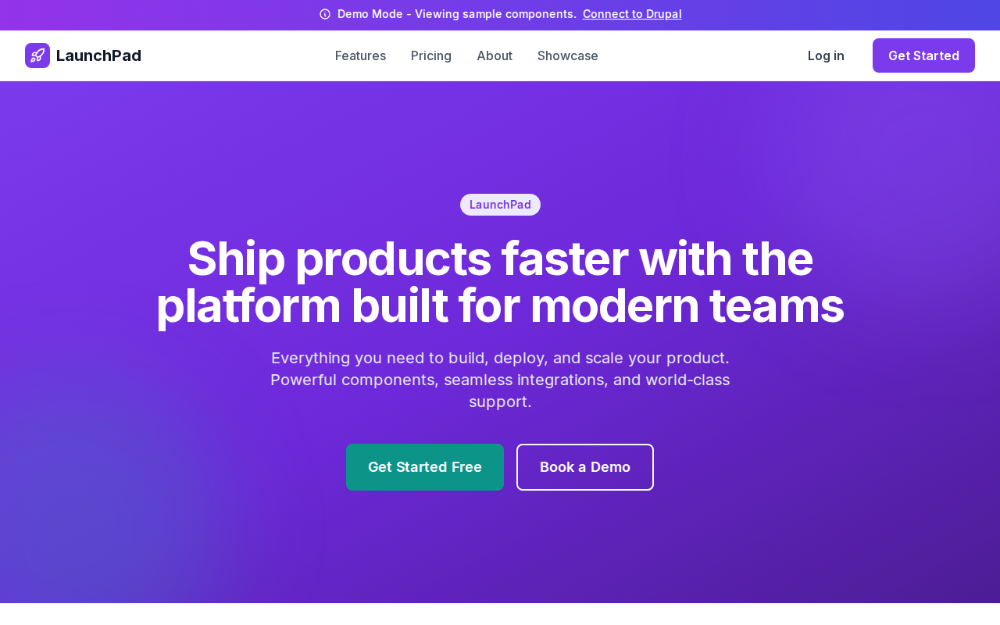

# Decoupled Components

A component showcase starter for Decoupled Drupal + Next.js. Demonstrates 10 paragraph-style components for building landing pages.



## Features

- **10 Paragraph Components** - Hero, Cards, Sidebyside, Accordion, Testimonials, Pricing, Logos, Stats, Newsletter, Text
- **Component Showcase** - Interactive gallery at `/showcase`
- **Skeleton Loading** - Beautiful loading states for all components
- **Demo Mode** - Works without Drupal for preview
- **Modern Design** - Purple/indigo theme with Tailwind CSS

## Quick Start

### 1. Clone the template

```bash
npx degit nextagencyio/decoupled-components my-components-site
cd my-components-site
npm install
```

### 2. Run interactive setup

```bash
npm run setup
```

This interactive script will:
- Authenticate with Decoupled.io (opens browser)
- Create a new Drupal space
- Wait for provisioning (~90 seconds)
- Configure your `.env.local` file
- Import sample content with Unsplash images

### 3. Start development

```bash
npm run dev
```

Visit [http://localhost:3000](http://localhost:3000)

---

## Manual Setup

If you prefer to run each step manually:

<details>
<summary>Click to expand manual setup steps</summary>

### Authenticate with Decoupled.io

```bash
npx decoupled-cli@latest auth login
```

### Create a Drupal space

```bash
npx decoupled-cli@latest spaces create "My Components Site"
```

Note the space ID returned (e.g., `Space ID: 1234`). Wait ~90 seconds for provisioning.

### Configure environment

```bash
npx decoupled-cli@latest spaces env 1234 --write .env.local
```

### Import content

```bash
npm run setup-content
```

This imports:
- 10 paragraph types with all fields
- Homepage with all components demonstrated
- About page with team cards
- Sample content with Unsplash images

</details>

## Paragraph Types

### Hero Section
- Eyebrow, Title, Subtitle
- Background image/color
- Primary & secondary CTAs

### Card Group
- Eyebrow, Title, Subtitle
- Nested cards with icons
- Configurable columns (2-4)

### Side by Side
- Content + Image layout
- Feature list with icons
- Image position (left/right)

### Accordion / FAQ
- Collapsible sections
- Eyebrow, Title, Subtitle
- Multiple FAQ items

### Quote / Testimonials
- Author info with photo
- Star ratings
- Grid or single layout

### Pricing
- Multiple pricing tiers
- Feature lists
- Featured tier highlight

### Logo Collection
- Client/partner logos
- Grayscale hover effect

### Stats
- Key metrics display
- Value, label, description

### Newsletter
- Email signup form
- Light/dark backgrounds

### Text Block
- Rich text content
- Alignment options
- Optional CTA

## Customization

### Colors & Branding
Edit `tailwind.config.js` to customize colors, fonts, and spacing.

### Content Structure
Modify `data/components-content.json` to add or change paragraph types and sample content.

### Components
React components are in `app/components/paragraphs/`. Update them to match your design needs.

## Deployment

### Vercel (Recommended)
[](https://vercel.com/new/clone?repository-url=https://github.com/nextagencyio/decoupled-components)

### Other Platforms
Works with any Node.js hosting platform that supports Next.js.

## Documentation

- [Decoupled.io Docs](https://www.decoupled.io/docs)
- [Next.js Documentation](https://nextjs.org/docs)
- [Drupal GraphQL](https://www.decoupled.io/docs/graphql)

## License

MIT
