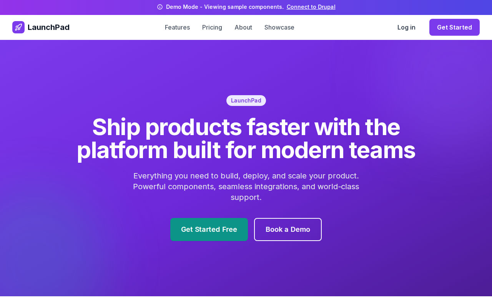

# Decoupled Components

A component showcase starter for Decoupled Drupal + Next.js with a built-in visual page builder. Demonstrates 10 paragraph-style components for building landing pages — editable via drag-and-drop with [Puck Editor](https://puckeditor.com) and AI-assisted content generation.



## Features

- **10 Paragraph Components** — Hero, Cards, SideBySide, Accordion, Testimonials, Pricing, Logos, Stats, Newsletter, Text
- **Visual Page Builder** — Drag-and-drop editor powered by Puck with live preview
- **AI Content Generation** — Generate pages and sections with natural language via Groq/Llama
- **Component Showcase** — Interactive gallery at `/showcase`
- **Paragraph-Backed Storage** — All visual editor content saves as real Drupal paragraph entities
- **Skeleton Loading** — Beautiful loading states for all components
- **Demo Mode** — Works without Drupal for preview (set `NEXT_PUBLIC_DEMO_MODE=true`)
- **Modern Design** — Purple/indigo theme with Tailwind CSS

## Quick Start

### 1. Clone the template

```bash
npx degit nextagencyio/decoupled-components my-components-site
cd my-components-site
npm install
```

### 2. Run interactive setup

```bash
npm run setup
```

This interactive script will:
- Authenticate with Decoupled.io (opens browser)
- Create a new Drupal space
- Wait for provisioning (~90 seconds)
- Configure your `.env.local` file
- Import sample content with Unsplash images
- Auto-enable the Puck visual editor for your landing pages

### 3. Start development

```bash
npm run build
npm start
```

**Important:** Use `npm start` (production mode) for the visual editor. The dev server's HMR causes memory issues with Puck's live re-rendering.

Visit [http://localhost:3000](http://localhost:3000)

---

## Visual Page Builder

The starter includes a built-in visual page builder powered by [Puck Editor](https://puckeditor.com). Design landing pages with drag-and-drop components that save to Drupal as real paragraph entities.

### How It Works

1. Navigate to any landing page in Drupal and click the **Design Studio** tab
2. The Puck editor opens with your components in the sidebar
3. Drag components onto the canvas, edit fields in the right panel
4. Click **Publish** to save back to Drupal as paragraph entities
5. The frontend renders the same paragraphs via GraphQL

### Architecture

```
Drupal (CMS)                          Next.js (Frontend + Editor)
├── dc_puck module                    ├── /editor/[nid]       ← Puck editor + AI
│   ├── Design Studio tab             ├── /node/[nid]         ← Preview render
│   ├── PuckMappingService            ├── /[...slug]          ← Frontend pages
│   ├── /api/puck/load/{nid}          ├── /api/drupal-puck/   ← Proxy to Drupal
│   ├── /api/puck/save/{nid}          ├── /api/ai/generate    ← Groq AI endpoint
│   └── Signed token auth             ├── /api/puck/[...all]  ← Puck Cloud AI proxy
│                                     └── /api/upload/        ← Cloudinary proxy
├── Paragraph entities (field_sections)
└── GraphQL (graphql_compose)
```

### AI-Assisted Content

The editor ships with **two AI providers** — switch between them with an environment variable:

| Provider | Plugin | Backend | Cost | Env Var |
|----------|--------|---------|------|---------|
| **Groq** (default) | `puck-plugin-ai` | Groq/Llama via Vercel AI SDK | Free (Groq free tier) | `GROQ_API_KEY` |
| **Puck Cloud** | `@puckeditor/plugin-ai` | Puck's hosted AI | $25/mo + per-use | `PUCK_API_KEY` |

Set the provider in `.env.local`:

```env
# "groq" (default) or "puck-cloud"
NEXT_PUBLIC_PUCK_AI_PROVIDER=groq

# Groq (free)
GROQ_API_KEY=your_groq_api_key

# Puck Cloud (paid — https://cloud.puckeditor.com)
PUCK_API_KEY=your_puck_cloud_api_key
```

Both support natural language page generation:

| User Says | Action |
|-----------|--------|
| "Create a landing page for a coffee shop" | Generates full page |
| "Add a pricing section with 3 tiers" | Appends to existing page |
| "Rewrite the hero with better copy" | Updates specific section |

### Single Source of Truth

`data/components-content.json` drives everything:

- **Drupal:** Creates paragraph types and fields via `dc_import`
- **Drupal:** `dc_puck` auto-detects paragraph types and generates field mapping
- **Puck:** Editor config auto-generated from the same JSON at build time
- **Content:** Sample data imported from the `content` section

### Adding New Components

1. Add paragraph model with `puck` key to `data/components-content.json`
2. Create a React component in `app/components/paragraphs/`
3. Add one line to `lib/component-registry.tsx`
4. Run `npm run setup-content` to create in Drupal + rebuild

---

## Manual Setup

If you prefer to run each step manually:

<details>
<summary>Click to expand manual setup steps</summary>

### Authenticate with Decoupled.io

```bash
npx decoupled-cli@latest auth login
```

### Create a Drupal space

```bash
npx decoupled-cli@latest spaces create "My Components Site"
```

Note the space ID returned (e.g., `Space ID: 1234`). Wait ~90 seconds for provisioning.

### Configure environment

```bash
npx decoupled-cli@latest spaces env 1234 --write .env.local
```

Add AI and image upload keys to `.env.local`:
```env
# AI (optional)
GROQ_API_KEY=your_groq_api_key
UNSPLASH_ACCESS_KEY=your_unsplash_key

# Image uploads (optional)
NEXT_PUBLIC_CLOUDINARY_CLOUD_NAME=your_cloud_name
NEXT_PUBLIC_CLOUDINARY_API_KEY=your_api_key
CLOUDINARY_API_SECRET=your_api_secret
```

### Import content

```bash
npm run setup-content
```

This imports:
- 10 paragraph types with all fields
- Homepage with all components demonstrated
- About page with team cards
- Sample content with Unsplash images
- Auto-enables Puck editor for the `landing_page` content type

</details>

## Paragraph Types

### Hero Section
- Eyebrow, Title, Subtitle
- Background image/color (gradient, dark, light)
- Primary & secondary CTAs

### Card Group
- Eyebrow, Title, Subtitle
- Nested cards with Lucide icons
- Configurable columns (2-4)

### Side by Side
- Content + Image layout
- Feature list with icons
- Image position (left/right), CTA

### Accordion / FAQ
- Collapsible sections
- Eyebrow, Title, Subtitle
- Multiple FAQ items

### Quote / Testimonials
- Author info with photo
- Star ratings
- Grid or single layout

### Pricing
- Multiple pricing tiers
- Feature lists per tier
- Featured tier highlight, CTAs

### Logo Collection
- Client/partner logos
- Grayscale hover effect

### Stats
- Key metrics display
- Value, label, description

### Newsletter
- Email signup form
- Light/dark/gradient backgrounds

### Text Block
- Rich text content
- Alignment options (left/center)
- Optional CTA

## Customization

### Colors & Branding
Edit `tailwind.config.js` to customize colors, fonts, and spacing.

### Content Structure
Modify `data/components-content.json` to add or change paragraph types and sample content. The Puck editor config auto-generates from this file.

### Components
React components are in `app/components/paragraphs/`. Update them to match your design needs — the visual editor uses the same components.

## Demo Mode

Demo mode allows you to showcase the application without connecting to a Drupal backend. It displays all 10 paragraph components with sample content.

### Enable Demo Mode

Set the environment variable:

```bash
NEXT_PUBLIC_DEMO_MODE=true
```

### What Demo Mode Does

- Shows a "Demo Mode" banner at the top of the page
- Displays the DemoHomepage component with all paragraph types
- No Drupal backend required

### Removing Demo Mode

To convert to a production app with real data:

1. Delete `lib/demo-mode.ts`
2. Delete `app/components/DemoHomepage.tsx`
3. Delete `app/components/DemoModeBanner.tsx`
4. Remove `DemoModeBanner` import and usage from `app/(site)/layout.tsx`
5. Remove demo mode check from `app/(site)/page.tsx`

## Deployment

### Vercel (Recommended)
[](https://vercel.com/new/clone?repository-url=https://github.com/nextagencyio/decoupled-components)

Set `NEXT_PUBLIC_DEMO_MODE=true` in Vercel environment variables for a demo deployment.

### Other Platforms
Works with any Node.js hosting platform that supports Next.js.

## Tech Stack

- **Next.js 16** (App Router, React 19)
- **@puckeditor/core 0.21** (drag-and-drop visual editor)
- **[puck-plugin-ai](https://github.com/nextagencyio/puck-plugin-ai)** (AI chat — Groq/Llama via Vercel AI SDK)
- **@puckeditor/plugin-ai** (official Puck Cloud AI — optional)
- **Tailwind CSS 3** (component styling)
- **Apollo Client** (GraphQL data fetching)
- **Cloudinary** (image upload and hosting)
- **Drupal 11** (headless CMS backend)
- **graphql_compose** (GraphQL schema generation)

## Documentation

- [Decoupled.io Docs](https://www.decoupled.io/docs)
- [Next.js Documentation](https://nextjs.org/docs)
- [Puck Editor](https://puckeditor.com)
- [puck-plugin-ai](https://github.com/nextagencyio/puck-plugin-ai)

## License

MIT
