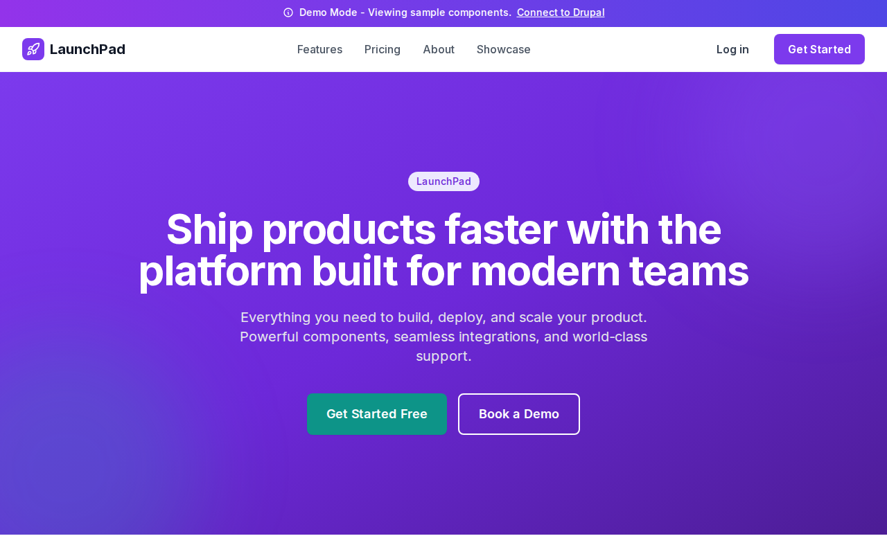

# Decoupled Components

A component showcase starter for Decoupled Drupal + Next.js with a built-in visual page builder. Demonstrates 10 paragraph-style components for building landing pages — editable in the [Drupal Canvas](https://www.drupal.org/project/canvas) visual editor with live preview.



## Features

- **10 Paragraph Components** — Hero, Cards, SideBySide, Accordion, Testimonials, Pricing, Logos, Stats, Newsletter, Text
- **Visual Page Builder** — Drupal Canvas editor with live draft preview in this app
- **Component Showcase** — Interactive gallery at `/showcase`
- **One set of components** — Canvas pages and GraphQL paragraph pages render the same React components
- **Skeleton Loading** — Beautiful loading states for all components
- **Demo Mode** — Works without Drupal for preview (set `NEXT_PUBLIC_DEMO_MODE=true`)
- **Modern Design** — Purple/indigo theme with Tailwind CSS

## Quick Start

### 1. Clone the template

```bash
npx degit nextagencyio/decoupled-components my-components-site
cd my-components-site
npm install
```

### 2. Run interactive setup

```bash
npm run setup
```

This uses `decoupled-cli` to:
- Authenticate with Decoupled.io (opens browser)
- Create a new Drupal space
- Wait for provisioning (~90 seconds)
- Configure your `.env.local` file
- Import sample content (10 paragraph types, 2 landing pages)

### 3. Generate typed client from your schema

```bash
npm run sync-schema
```

Introspects the Drupal GraphQL schema and generates a fully typed client in `schema/client.ts` — TypeScript interfaces for every content type and paragraph, pre-built GraphQL queries, and a `createTypedClient()` factory. Zero hand-written GraphQL needed.

### 4. Start the site

```bash
npm run build
npm start
```

Visit [http://localhost:3000](http://localhost:3000)

---

## Visual Page Builder

Pages are built in the [Drupal Canvas](https://www.drupal.org/project/canvas)
editor (`/canvas` on the Drupal site, which needs the `dc_canvas` module). Canvas
embeds this app as its live preview and syncs its component library from it, using
`@drupal-canvas/headless-next`. Editors see unsaved changes in the real frontend;
visitors only see what has been published.

### How It Works

- **Components:** `canvas/<machine_name>/{component.yml,index.tsx}`. There are 10
  sections plus 7 child items (cards, FAQ items, testimonials, pricing tiers, logos,
  stats, features), which go into their parent's slot. Each `index.tsx` is a thin
  wrapper around the same `app/components/paragraphs/*` components that render
  GraphQL paragraph pages, so there is one source of markup.
- **Routing:** `app/(site)/page.tsx` and `[...slug]/page.tsx` try Canvas first
  (`lib/canvas.ts`, which is draft-aware) and fall back to GraphQL landing pages.
  The homepage is the Drupal front page, or a Canvas page with the alias `/home`.
- **Canvas routes:** `/api/draft`, `/api/disable-draft`, `/api/canvas/components`,
  `/api/canvas/component-preview` and `/api/canvas/jsonapi/*`. `proxy.ts` handles
  the draft session and the CSP `frame-ancestors` header for the editor iframe.
- **Env:** `CANVAS_SITE_URL` defaults to `NEXT_PUBLIC_DRUPAL_BASE_URL`. Draft
  preview needs a Chromium browser, because the preview cookie is partitioned.

### Adding New Components

Create `canvas/<name>/component.yml` (props as JSON schema, plus slots) and
`index.tsx`, then reload the Canvas editor to sync it. The `component.yml` files
are shared with the Astro starter (`decoupled-components-astro`); keep them
identical if one Drupal site serves both frontends.

## Manual Setup

If you prefer to run each step manually:

<details>
<summary>Click to expand manual setup steps</summary>

### Authenticate with Decoupled.io

```bash
npx decoupled-cli@latest auth login
```

### Create a Drupal space

```bash
npx decoupled-cli@latest spaces create "My Components Site"
```

Note the space ID returned (e.g., `Space ID: 1234`). Wait ~90 seconds for provisioning.

### Configure environment

```bash
npx decoupled-cli@latest spaces env 1234 --write .env.local
```

### Import content

```bash
npm run setup-content
```

This imports:
- 10 paragraph types with all fields
- Homepage with all components demonstrated
- About page with team cards
- Sample content with Unsplash images

</details>

## Paragraph Types

### Hero Section
- Eyebrow, Title, Subtitle
- Background image/color (gradient, dark, light)
- Primary & secondary CTAs

### Card Group
- Eyebrow, Title, Subtitle
- Nested cards with Lucide icons
- Configurable columns (2-4)

### Side by Side
- Content + Image layout
- Feature list with icons
- Image position (left/right), CTA

### Accordion / FAQ
- Collapsible sections
- Eyebrow, Title, Subtitle
- Multiple FAQ items

### Quote / Testimonials
- Author info with photo
- Star ratings
- Grid or single layout

### Pricing
- Multiple pricing tiers
- Feature lists per tier
- Featured tier highlight, CTAs

### Logo Collection
- Client/partner logos
- Grayscale hover effect

### Stats
- Key metrics display
- Value, label, description

### Newsletter
- Email signup form
- Light/dark/gradient backgrounds

### Text Block
- Rich text content
- Alignment options (left/center)
- Optional CTA

## Customization

### Colors & Branding
Edit `tailwind.config.js` to customize colors, fonts, and spacing.

### Content Structure
Modify `data/components-content.json` to add or change paragraph types and sample content.

### Components
React components are in `app/components/paragraphs/`. Update them to match your design needs — the visual editor uses the same components.

## Demo Mode

When `NEXT_PUBLIC_DEMO_MODE` is not set to `false`, the app uses mock data from `data/mock/` instead of querying Drupal. The same `TypedClient` interface is used — pages don't know the difference.

```bash
NEXT_PUBLIC_DEMO_MODE=true   # Uses mock data (no Drupal needed)
NEXT_PUBLIC_DEMO_MODE=false  # Uses live Drupal backend
```

## Deployment

### Vercel (Recommended)
[](https://vercel.com/new/clone?repository-url=https://github.com/nextagencyio/decoupled-components)

Set `NEXT_PUBLIC_DEMO_MODE=true` in Vercel environment variables for a demo deployment.

### Other Platforms
Works with any Node.js hosting platform that supports Next.js.

## Tech Stack

- **Next.js 16** (App Router, React 19)
- **Drupal Canvas headless** (`@drupal-canvas/headless-next`, visual editor integration)
- **Tailwind CSS 3** (component styling)
- **decoupled-client** (type-safe Drupal client with codegen)
- **Drupal 11** (headless CMS backend)
- **graphql_compose** (GraphQL schema generation)

## Documentation

- [Decoupled.io Docs](https://www.decoupled.io/docs)
- [Next.js Documentation](https://nextjs.org/docs)
- [Drupal Canvas](https://www.drupal.org/project/canvas)

## License

MIT
